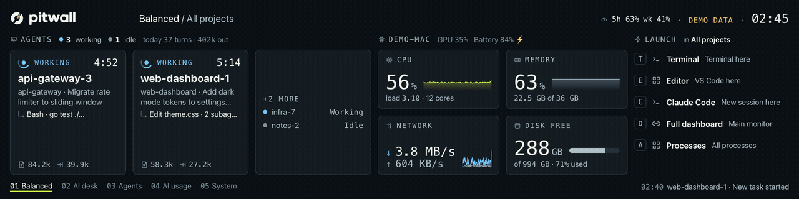
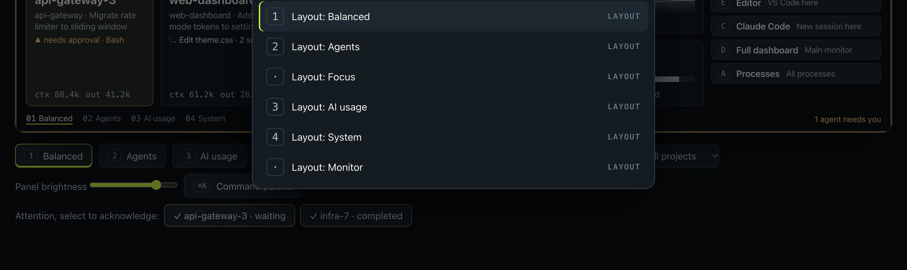
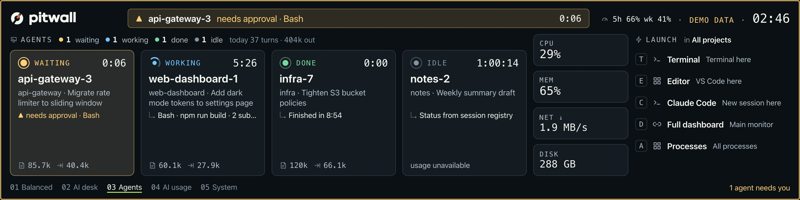
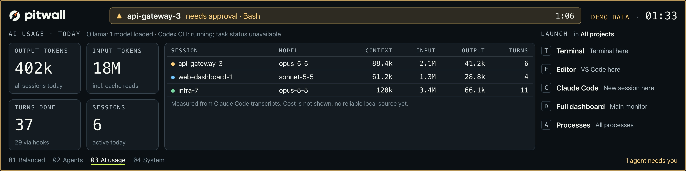
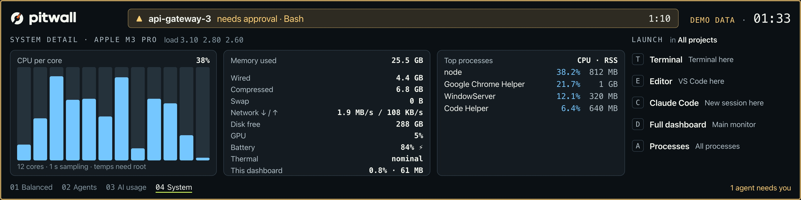
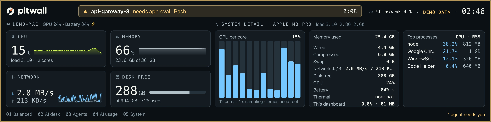

<p align="center">
  <picture>
    <source media="(prefers-color-scheme: dark)" srcset="assets/brand/dial-lockup-light.svg">
    
  </picture>
</p>

<h3 align="center">Your setup. In view.</h3>

<p align="center">
  A personal command center for your AI agents and your machine, on a dedicated display.<br>
  <a href="https://goriparthi.github.io/pitwall/"><b>Website</b></a> ·
  <a href="#get-started">Get started</a> ·
  <a href="#templates">Templates</a> ·
  <a href="#whats-real">What's real</a>
</p>

<p align="center">
  
  
  
  
</p>



<sub>Recorded from a real build at the Lian Li 8.8" Universal Screen's native 1920 x 480, running Pitwall's labelled demo story.</sub>

Pitwall turns a dedicated display, starting with the **Lian Li 8.8" Universal Screen** (US88, SM088X), into a glanceable view of your **Claude Code agents**, your **machine** and your **shortcuts**. When an agent needs you, you see it before you go looking. One Go binary for macOS and Windows; everything stays on your machine.

## Highlights

- **Attention you can't miss.** When a session asks for approval, asks a question or fails, the panel header turns into an amber alert and the screen edge glows. The LED ring breathes amber, and the menu bar shows `▲ 1`.
- **Agents at a glance.** Every Claude Code session as working, waiting, done, failed or idle, with its task title, latest tool, elapsed time, context size and measured tokens.
- **Machine health.** CPU, memory, network and disk with short trends, plus GPU, battery and the busiest processes.
- **A safe launcher.** Open a terminal, editor or new Claude session in the current project. Only actions you list in config can run.
- **Templates.** Six layouts out of the box, switchable with a number key; override or add your own in JSON.
- **Private by default.** Loopback only, token protected, and hooks forward event names, never prompts, commands or output.

## Get started

```sh
git clone https://github.com/goriparthi/pitwall && cd pitwall
scripts/build.sh                  # bin/pitwall, plus dist/: Pitwall.app, macOS arm64, Windows amd64/arm64
bin/pitwall hooks install         # Claude Code hooks (backs up ~/.claude/settings.json first)
bin/pitwall start                 # background: server, panel, LED ring, menu bar item, hotkeys
```

No screen yet? `bin/pitwall run --demo --no-display`, then open http://127.0.0.1:7788/?view=full.

| Command | What it does |
| --- | --- |
| `pitwall start` / `stop` / `status` | Run in the background and control it |
| `pitwall open` | Full dashboard on the main monitor |
| `pitwall run [--demo] [--no-display] [--no-tray]` | Run in the foreground |
| `pitwall hooks install` / `uninstall` / `status` | Manage the Claude Code hook entries |
| `pitwall selftest` | Fake "needs approval" session: amber alert and LED breathing, end to end |
| `pitwall probe [led]` | Push an orientation frame, or blink the LED ring |
| `pitwall config` | Print the config file path |

**Requirements:** Go 1.26+ to build. Chrome, Edge or Brave for rendering (Edge ships with Windows). On macOS, Homebrew `libusb` at build time; it is linked statically, so the binary needs nothing at runtime. Windows builds need no cgo.

## Driving it

The panel has no touch, so nothing on it pretends to be a button. Drive it from anywhere:

| macOS | Windows | Action |
| --- | --- | --- |
| `⌃⌥F` | `Ctrl+Alt+F` | Focus on working, waiting and failed agents |
| `⌃⌥1` to `⌃⌥9` | `Ctrl+Alt+1` to `9` | Switch layout |
| `⌃⌥H` | `Ctrl+Alt+H` | Privacy mode (hides names, projects and tasks) |
| `⌃⌥R` | `Ctrl+Alt+R` | Rotate layouts |
| `⌃⌥D` / `⌃⌥K` | `Ctrl+Alt+D` / `K` | Full dashboard / command palette |

The menu bar (macOS) or tray (Windows) item lists your sessions, actions, layouts and projects. The full dashboard mirrors the panel with controls, an attention queue, a brightness slider and a ⌘K palette.



## Templates

| | |
| --- | --- |
| **Agents**: room for four sessions  | **AI usage**: today's measured tokens and turns  |
| **System**: per-core CPU, memory, processes  | **Monitor**: health and system detail together  |

Built-in layouts: `balanced` (default), `agents`, `focus`, `usage`, `system`, `monitor`. Each is a grid of up to four widget slots: `ai`, `health`, `health-mini`, `launcher`, `usage`, `system`.

Edit the config (`pitwall config` prints its path; the menu has "Edit config…"). Changes apply within two seconds. Invalid edits are rejected and logged, and the previous config stays active.

```json
"ui": { "layouts": ["balanced", "wide", "usage"] },
"layouts": [
  { "id": "wide", "name": "Wide agents", "columns": ["1300px", "1fr"], "slots": ["ai", "launcher"] }
]
```

A user layout with a built-in id overrides it; delete the entry to get the default back. `ui.layouts` sets the number-key order and the rotation cycle.

The config has four other sections:

- `projects`: the project switcher and the launcher's target.
- `actions`: the only things the launcher can run (`terminal`, `open-app`, `open-url`), with optional `mac`/`windows` overrides.
- `display`: `fps`, `rotation`, `jpegQuality`, `brightness`.
- `led`: `enabled`, `maxBrightness`, `workingGlow`.

## What's real

| Data | Source |
| --- | --- |
| Sessions, busy/idle | `~/.claude/sessions/*.json`, written by Claude Code (undocumented, read only) |
| Approval waits, questions, failures, tool activity | Claude Code hooks; only event name, tool and file basename are forwarded |
| Task title, tokens, context | transcript `ai-title` and `usage` fields; message content is not decoded |
| Cost | not shown; no reliable local source yet |
| Codex, Cursor, Claude Desktop | process presence only: "running; task status unavailable" |
| Ollama | local API, loaded models |
| CPU, memory, disk, network, processes | macOS tools, gopsutil on Windows |
| GPU, thermal | macOS only for now; die temperatures need root and are not collected |

## How it works

```
internal/collect/{system,claude,tools,demo}   telemetry (OS specifics in *_darwin.go / *_windows.go)
internal/server                                loopback API, SSE, embedded web UI (web/)
internal/display/bridge                        headless Chromium screencast of ?view=panel -> JPEG
internal/display/{us88,ledring}                device protocols over internal/usb (libusb on macOS, WinUSB on Windows)
internal/display/lights                        LED attention policy
internal/tray                                  menu bar / tray + global hotkeys
internal/hooks                                 Claude Code hook forwarder and installer
```

The UI is a web page that the bridge only captures, so another screen needs only a new transport.

**Hardware.** The screen enumerates as USB `1cbe:a088` and the LED ring as `0416:8050`. The frame protocol follows the open source [lian-li-linux](https://github.com/sgtaziz/lian-li-linux) driver. No firmware is modified, nothing is saved to the device, and the vendor "desktop mode" switch is not used. If the panel stops taking frames, Pitwall reconnects with backoff; if it stays stuck, unplug and replug the screen. Never USB-reset it, because a reset takes it off the bus until it is power cycled.

**Windows (early).** Builds and passes static checks, but is unverified on hardware. It assumes Windows binds the WinUSB driver to the screen and ring, which the vendor driver's naming suggests. Quit L-Connect first, because it holds the devices, then run `pitwall probe`.

**Security.** Binds to 127.0.0.1 only and checks the Host header against DNS rebinding. Every POST needs the per-install token (0600, inlined into the served page) and a same-origin Origin. Request bodies are capped at 16 KB and actions are rate limited. State and logs live in `~/.local/state/pitwall` (macOS) or `%LOCALAPPDATA%\pitwall` (Windows).

**Resource use.** On an M3 Pro, about 15 to 17% of one core while an agent is working (6 fps) and roughly half that when calm (2 fps), measured by process CPU time. Most of it is the headless renderer; the Go process is about 3 to 5%.

## Brand

The mark is the Dial: a split ring with an orange needle, paired with the brand kit's drawn wordmark. `scripts/brand/dial.py` generates the vectors, and `scripts/brand/build-icons.sh` rebuilds every icon from them: the macOS `.icns` and menu bar template, the Windows `.ico`, and the web icons. Orange belongs to the logo only. The UI accent stays Pit Lime so that amber always means "waiting", and status colors are never the accent. Tokens, the component spec and the implementation guide live in `assets/design/`. The Windows `.exe` icon comes from `cmd/pitwall/rsrc_windows_*.syso`; regenerate it with `go run github.com/tc-hib/go-winres@latest simply --icon assets/icons/windows/icon-256.png` in that folder.

## Development

```sh
PKG_CONFIG=$PWD/scripts/pkg-config go test ./...    # the pkg-config shim links static libusb on macOS
GOOS=windows go vet ./...
PITWALL_PPROF=127.0.0.1:6060 bin/pitwall run        # profiling
```

The website lives in `site/` and deploys to GitHub Pages on every push that changes it.

## Next

1. Verify Windows on real hardware.
2. Exact session cost from the Claude Code status line.
3. Codex session telemetry from `~/.codex/sessions`.
4. Windows GPU and thermal metrics.
5. Signed releases and an opt-in start at login.

## License

MIT. Not affiliated with or endorsed by Lian Li. Claude and Claude Code are trademarks of Anthropic.
