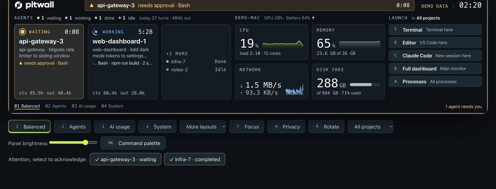

<p align="center">
  <picture>
    <source media="(prefers-color-scheme: dark)" srcset="assets/brand/dial-lockup-light.svg">
    
  </picture>
</p>

<p align="center">
  <a href="https://goriparthi.github.io/pitwall/">Website</a> ·
  <a href="#get-started">Get started</a> ·
  <a href="#how-a-dashboard-fits-together">Templates and config</a> ·
  <a href="#compatibility">Compatibility</a>
</p>

Pitwall is a dashboard for the screen beside your monitor. It shows CPU, memory, network and disk, the Claude Code sessions you have running, and shortcuts to the tools you open most. You pick a template and it fills in with live data from your computer. It drives the Lian Li 8.8" Universal Screen over USB, or runs in a browser window if you don't have one.

**Status:** early development. Works on macOS today; Windows builds are in testing. There's no installer yet. MIT licensed.


<sub>Recorded from Pitwall's demo mode at the display's native 1920 x 480. Names and numbers are demo data.</sub>

## The default layout

Balanced is the template Pitwall starts with. From left to right:

1. **Header.** The layout and project you're looking at. When an agent needs you, it turns into an amber alert saying who is waiting, for what, and for how long.
2. **Agents.** One card per Claude Code session: status, time in that status, task title, latest tool, context size and output tokens.
3. **Computer.** CPU with a 90 second trend, memory, network down and up, and free disk. GPU and battery sit in the label row.
4. **Launcher.** Your shortcuts and their keys. The screen has no touch, so you run them from the menu bar or the desktop dashboard.
5. **Footer.** Template tabs with their number keys, and either the attention count or the latest event.

Values refresh on their own schedule, from every second for CPU to every 15 seconds for disk space.

## Examples

### A workstation or home server

The Monitor template shows health and detail side by side: CPU per core with load averages, memory split into used, wired, compressed and swap, network throughput, free disk, and the busiest processes with their CPU and memory use. On macOS it adds GPU, battery and thermal state.


Not yet: checks on services (HTTP, ports, ping) and watching other machines. Both are planned.

### Running coding agents

With the Claude Code hooks installed, Pitwall hears about each session as it works. When one asks for approval, asks a question or fails:

- the screen's header turns amber and its edge lights up
- the display's LED ring breathes amber
- the menu bar shows `▲ 1`


The AI usage template adds today's measured token totals and a row per running session. Ollama shows which models are loaded. Codex, Cursor and Claude Desktop are only detected as running, with no task detail. Not yet: cost, and task detail for agents other than Claude Code.

## How a dashboard fits together

| Term | What it is |
| --- | --- |
| Template | A named grid of up to four widgets. Six ship with Pitwall: `balanced`, `agents`, `focus`, `usage`, `system`, `monitor`. |
| Widget | One block of the screen: `ai`, `health`, `health-mini`, `launcher`, `usage`, `system`. |
| Data source | Where the numbers come from. Today these are built in: your computer's own counters, Claude Code's session files and hooks, and Ollama's local API. Sources you add yourself are planned. |
| Action | A launcher entry: a terminal or app opened in the selected project, or a URL. Only actions listed in the config can run. |

All of it lives in one JSON file; `pitwall config` prints its path. Pitwall rereads the file within two seconds. If an edit is invalid, it keeps the last working version and logs why.

```json
"ui": { "layouts": ["balanced", "wide", "monitor"] },
"layouts": [
  { "id": "wide", "name": "Wide agents", "columns": ["1300px", "1fr"], "slots": ["ai", "launcher"] }
],
"actions": [
  { "id": "claude", "label": "Claude Code", "key": "c", "kind": "terminal", "app": "iTerm", "run": "claude" }
]
```

`ui.layouts` sets which templates get number keys and the order they rotate in. A layout that reuses a built-in id replaces it; delete the entry to get the default back. Actions can carry `mac` and `windows` overrides. The `display` section sets frame rate, rotation, JPEG quality and brightness, and `led` controls the ring.

## Get started

There's no installer yet, so you build Pitwall with Go:

```sh
git clone https://github.com/goriparthi/pitwall && cd pitwall
scripts/build.sh               # bin/pitwall, plus dist/: Pitwall.app and Windows builds
bin/pitwall hooks install      # optional: Claude Code hooks, after backing up ~/.claude/settings.json
bin/pitwall start              # runs in the background with a menu bar icon
bin/pitwall open               # the desktop dashboard in your browser
```

No display? Try `bin/pitwall run --demo --no-display` and open http://127.0.0.1:7788/?view=full.

You'll need Go 1.26 or newer, and Chrome, Edge or Brave, which renders the display. On macOS, Homebrew's `libusb` is needed at build time; it's linked in, so nothing extra is needed at run time. Windows builds don't need cgo.

| Command | What it does |
| --- | --- |
| `pitwall start`, `stop`, `status` | Run in the background and control it |
| `pitwall open` | Open the desktop dashboard |
| `pitwall run [--demo] [--no-display] [--no-tray]` | Run in the foreground |
| `pitwall hooks install`, `uninstall`, `status` | Manage the 12 Claude Code hook entries |
| `pitwall selftest` | Fake an approval request to check the alert and LED ring end to end |
| `pitwall probe [led]` | Push a test frame to the display, or blink the LED ring |
| `pitwall config` | Print the config file path |

## Using it

The desktop dashboard mirrors the screen and adds what the screen can't have: template buttons, focus and privacy modes, a project filter, display brightness, and an attention list you can acknowledge.



The menu bar icon (a tray icon on Windows) lists your sessions, launcher actions, templates and projects. Hotkeys work from any app; on Windows they use Ctrl+Alt instead of ⌃⌥.

| Keys | Action |
| --- | --- |
| `⌃⌥1` to `⌃⌥9` | Switch template |
| `⌃⌥F` | Show only working, waiting and failed agents |
| `⌃⌥H` | Hide session names, projects and tasks |
| `⌃⌥R` | Rotate through templates |
| `⌃⌥D`, `⌃⌥K` | Desktop dashboard, command palette |

## Compatibility

| Area | Item | Status | Notes |
| --- | --- | --- | --- |
| System | macOS, Apple silicon | Works | Tested on macOS 26 |
| System | Windows 10 and 11 | In testing | Builds for x64 and ARM; not yet run on real hardware |
| System | Linux | Not supported | |
| Display | Lian Li 8.8" Universal Screen | Works on macOS | Over USB, including its LED ring; no firmware changes |
| Display | Any monitor | Works | The desktop dashboard in a browser window |
| Display | Other USB displays | Not supported | Display output is a separate module, so others can be added |
| Data | CPU, memory, disk, network, processes, battery | Works | macOS; the Windows versions are written but untested |
| Data | GPU and thermal state | macOS only | Temperatures need root and aren't read |
| Data | Claude Code | Works | Status, approvals, failures, measured tokens |
| Data | Ollama | Works | Which models are loaded |
| Data | Codex, Cursor, Claude Desktop | Detected only | Shown as running; no task detail |
| Planned | Service checks, cost, installers | Planned | Also Codex session detail and starting at login |

## Privacy and security

Pitwall listens on 127.0.0.1 only and checks the Host header to block DNS rebinding. Every change request needs a per-install token, which is kept in a file only you can read and placed in the page Pitwall serves, plus a same-origin Origin header. Request bodies are capped at 16 KB and actions are rate limited.

The hook forwarder sends event names, tool names and file basenames, never prompts, commands or output. Transcripts are read for the `usage` and `ai-title` fields only. State and logs live in `~/.local/state/pitwall` on macOS and `%LOCALAPPDATA%\pitwall` on Windows.

| Data | Source |
| --- | --- |
| Sessions, busy and idle | `~/.claude/sessions/*.json`, written by Claude Code (undocumented, read only) |
| Approvals, questions, failures, tool activity | Claude Code hooks |
| Task title, tokens, context size | Transcript `ai-title` and `usage` fields |
| Codex, Cursor, Claude Desktop | Process names only |
| Ollama | Its local API |
| System metrics | macOS tools; gopsutil on Windows |

## How it's built

```
internal/collect/{system,claude,tools,demo}   data sources (OS specifics in *_darwin.go and *_windows.go)
internal/server                                loopback API, server-sent events, embedded web UI (web/)
internal/display/bridge                        headless Chromium renders ?view=panel; frames go out as JPEG
internal/display/{us88,ledring}                display and LED protocols over internal/usb (libusb on macOS, WinUSB on Windows)
internal/display/lights                        what the LED ring shows
internal/tray                                  menu bar and tray icon, global hotkeys
internal/hooks                                 Claude Code hook forwarder and installer
```

The dashboard is a web page, and the display output only captures it, so supporting another screen means writing another output module.

**The Lian Li display.** It shows up as USB `1cbe:a088` and its LED ring as `0416:8050`. The frame protocol follows the open source [lian-li-linux](https://github.com/sgtaziz/lian-li-linux) driver. Pitwall never modifies firmware, never saves anything to the device, and doesn't use the vendor's "desktop mode". If the display stops taking frames, Pitwall reconnects. If it stays stuck, unplug it and plug it back in. Don't USB-reset it: a reset takes it off the bus until it's power cycled.

**Windows.** It assumes Windows binds the WinUSB driver to the display and ring, which the vendor driver's naming suggests. Quit L-Connect first, because it holds the devices, then run `pitwall probe`.

**Resource use.** On an M3 Pro, about 15 to 17% of one CPU core while an agent is working (6 fps), and roughly half that when everything is idle (2 fps). Most of it is the headless renderer; Pitwall itself uses 3 to 5%.

## Brand

The mark is the Dial, paired with the brand kit's drawn wordmark. `scripts/brand/dial.py` generates the vectors, and `scripts/brand/build-icons.sh` rebuilds every icon from them. Orange is reserved for the logo and the website's actions. Inside the app, the accent stays lime so that amber always means "waiting". Tokens and the component spec are in `assets/design/`.

## Development

```sh
PKG_CONFIG=$PWD/scripts/pkg-config go test ./...   # the pkg-config shim links libusb statically on macOS
GOOS=windows go vet ./...
scripts/capture-demo.sh                            # re-record the README GIF and website video
```

The website lives in `site/` and deploys to GitHub Pages when it changes.

## License

MIT. Not affiliated with or endorsed by Lian Li. Claude and Claude Code are trademarks of Anthropic.
